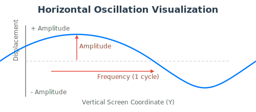

# Horizontal Oscillation Shader Design

This document outlines the design for creating a horizontal oscillation (or "wave") shader in Phaser 3, a common effect used for heat haze, underwater distortion, or other wavy visuals.

## Core Concept

create a video that explains how to create a horizontal oscillation effect (or wave) shader effect with glsl, this type of effect is commonly used for heat haze, underwater distortion or other wavy visuals.

The horizontal oscillation effect creates a visual distortion where the image appears to wobble or wave from side to side. This is achieved by displacing the horizontal position of each pixel based on a sine wave. The sine wave itself is animated over time, creating a smooth, continuous back-and-forth motion.

Instead of manipulating thousands of pixels on the CPU, this effect is handled entirely on the GPU via a fragment shader. The key is to calculate a horizontal offset for each pixel based on its vertical (`y`) position in the texture and the current `time`. This means pixels at the top of the image might be pushed to the left, while pixels in the middle are pushed to the right, creating a fluid wave pattern.

## Required Assets

1.  **Any Image:** Unlike scrolling, this effect does not require a tileable image. Any texture can have the wave effect applied to it.

## Visual Aid

This SVG diagram breaks down the process:

1.  **Original Pixel Column (Green):** Represents a straight, vertical line of pixels from the source image.
2.  **Sine Wave (Blue):** This is the mathematical instruction for the distortion. Its smooth, up-and-down curve determines how pixels will be shifted.
3.  **Distorted Column (Red):** This shows the final result. The horizontal position of each pixel in this red line is directly determined by the value of the blue sine wave at the same vertical position.

The goal is to clearly illustrate the relationship between the sine wave and the final pixel displacement, making the shader's logic easier to grasp.

## Shader Implementation (GLSL)

The effect is implemented in a custom GLSL fragment shader.

### Uniforms (Inputs)

The fragment shader will require the following inputs:

-   `sampler2D uMainSampler`: The primary texture to be distorted.
-   `float uTime`: A continuously increasing time value from Phaser to drive the animation.
-   `float uSpeed`: A multiplier to control the speed of the wave animation.
-   `float uAmplitude`: A multiplier that controls the magnitude of the wave, i.e., how far it pushes pixels to the left and right.
-   `float uFrequency`: A multiplier that controls the number of waves that appear vertically on the screen. Higher frequency means more, tighter waves.

### Fragment Shader Logic

For each pixel on the screen, the fragment shader will perform the following steps:

1.  **Get Original Coordinates:** Start with the original texture coordinate (`outTexCoord`) for the current pixel.
2.  **Calculate Sine Wave:** Use the `sin()` function to create the wave. The input to the sine function is a combination of the pixel's vertical position (`outTexCoord.y`), the `uFrequency`, and the `uTime` multiplied by `uSpeed`. This makes the wave move over time.
    - `float wave = sin(outTexCoord.y * uFrequency + uTime * uSpeed);`
3.  **Calculate Horizontal Offset:** Multiply the `wave` value by the `uAmplitude`. This scales the sine wave (which is in the -1.0 to 1.0 range) to control the maximum displacement.
    - `float offset = wave * uAmplitude;`
4.  **Apply Offset:** Add the calculated `offset` to the original horizontal texture coordinate (`outTexCoord.x`). The vertical coordinate remains unchanged.
    - `vec2 newCoords = vec2(outTexCoord.x + offset, outTexCoord.y);`
5.  **Sample Texture:** Use these new, distorted `newCoords` to look up the color from the main texture (`uMainSampler`).
6.  **Output Final Color:** Set the fragment's color (`gl_FragColor`) to the color retrieved from the texture.

## Phaser 3 Integration

This effect will be implemented as a custom `PostFXPipeline`.

1.  **Create Pipeline Class:** Define a new class that extends `Phaser.Renderer.WebGL.Pipelines.PostFXPipeline`.
2.  **Load Shader:** The pipeline's constructor will be given the GLSL code for the fragment shader.
3.  **Set Uniforms:**
    -   The `onPreRender` method will update the `uTime` uniform on every frame.
    -   We will create public properties or methods on the pipeline class (e.g., `speed`, `amplitude`, `frequency`) to allow the game code to easily control the shader's behavior.
4.  **Apply to Game Object:** The pipeline can be added to any Game Object with a texture, such as an `Image` or `Sprite`.

---

## Tutorial Script for Beginners

**(Video begins)**

**Host:** "Hey everyone! Have you ever seen a cool heat-haze effect in a desert level, or a gentle waving flag, or an underwater scene where everything seems to wobble? Today, we're going to pull back the curtain on how that's done using a **Horizontal Oscillation Shader**."

**(Visual: Show a final animation of an image waving back and forth.)**

**Host:** "This might look like a complex video effect, but it's actually a really clever math trick that your graphics card can do in real-time. The core idea is surprisingly simple: we're going to take an image and push its pixels left and right using a **sine wave**."

**(Visual: Show a static, straight image. Then, show a classic sine wave graph next to it.)**

**Host:** "Remember the sine wave from math class? It's just a smooth, repeating curve that goes up and down. We can use this wave as a set of instructions. Imagine laying this wave vertically alongside our image. Where the wave is at its peak, we push the pixels on that row all the way to the right. Where it's at its trough, we push them all the way to the left. And where it's in the middle, we don't move them at all."

**(Visual: Animate the sine wave being applied to the image. Show horizontal lines of pixels from the image being displaced left or right according to the shape of the sine wave, resulting in a static, wavy version of the image.)**

**Host:** "When we apply that to every row of pixels, we get this beautiful, wavy distortion of our original image. But right now, it's just a static picture. How do we make it move?"

**(Visual: Show the sine wave graph again, but this time, it's animated, scrolling smoothly to the side. As it scrolls, the distorted image updates in real-time to match the new shape of the wave.)**

**Host:** "We just make the sine wave itself move! Our shader gets a special variable, let's call it 'time', that is always increasing. By adding this 'time' value into our sine wave calculation, we cause the wave to glide smoothly across the image. And because the pixel distortion is based on the wave, the wobble animates perfectly along with it!"

**Host:** "We can even control how it looks. By making the sine wave taller or shorter, we can change how *far* the pixels get pushed—that's the amplitude. By making the wave more or less compressed, we can change how *many* waves appear on the screen—that's the frequency."

**Host:** "So, the image itself is never actually being bent. It's a simple illusion. For every pixel, the shader just asks, 'Where am I on the sine wave? Okay, I'll just take a tiny step to the left or right before I draw myself.' It's an incredibly powerful way to create organic-looking motion from a static image."

**Host:** "To recap: we use a moving sine wave as a guide to push the pixels of our image left and right, creating a smooth, oscillating animation. A fantastic trick for adding life and dynamic energy to your scenes. Thanks for watching!"

**(Video ends)**
